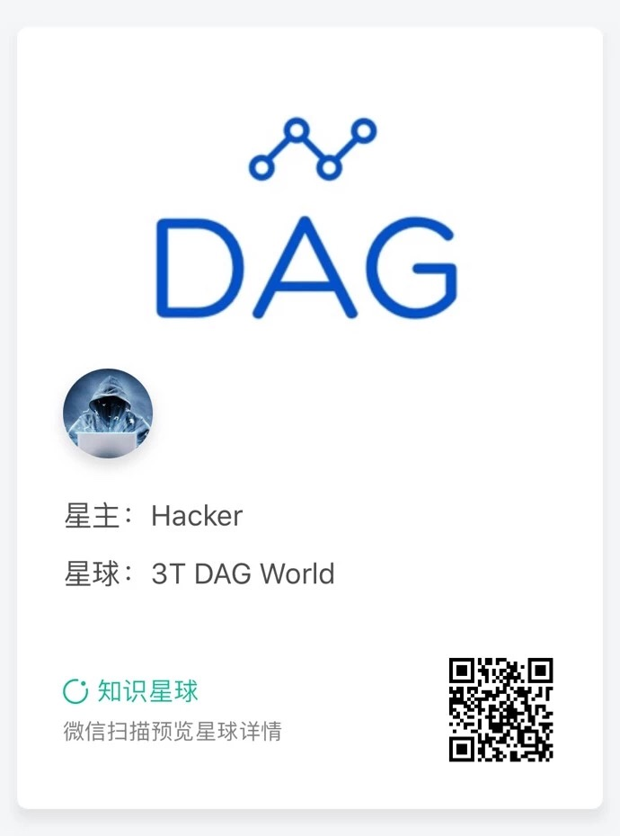

# how-to-code TrustNote 2.x

### 说明

这里是TrustNote开源社区的仓库，欢迎开发者来访。
本仓库里包含文档、工具和示例。全部基于TrustNote 2.x 开发工具包位于 https://github.com/trustnote/how-to-code/tree/master/devkit 

## SDK

### 一 挖矿助手SDK

当前的超级节点运行在终端和命令提示符中，普通用户很难从日志信息中知道是否挖矿成功。

如果不用助手SDK，开发者可以自行编写代码，从sqlite3数据库中读取与挖矿相关的数据。

linux系统中，sqlite3数据库位于：~/.config/trustnote-pow-supernode/trustnote.sqlite

以下是挖矿助手sdk的不同版本。sdk是对sqlite数据库操作的封装，欢迎开发者贡献代码改进它。

1 miningHelper sdk for python

sdk位于 https://github.com/trustnote/how-to-code/blob/master/devkit/miningHelper/python

示例代码 https://github.com/trustnote/how-to-code/blob/master/samples/miningDashboard/python

2 miningHelper sdk for ruby

sdk位于 https://github.com/trustnote/how-to-code/blob/master/devkit/miningHelper/ruby

示例代码 https://github.com/trustnote/how-to-code/tree/master/samples/miningDashboard/ruby

### 二 PRC服务SDK

1 rpc sdk for python

sdk位于 https://github.com/trustnote/how-to-code/tree/master/devkit/rpc/python

示例代码 https://github.com/trustnote/how-to-code/tree/master/samples/rpc/python

2 rpc sdk for ruby

sdk位于 https://github.com/trustnote/how-to-code/tree/master/devkit/rpc/ruby

示例代码 https://github.com/trustnote/how-to-code/tree/master/samples/rpc/ruby

其余的语言SDK，我们将做成任务包的形式，欢迎开源社区的开发者们积极参与。

## 各种大赛

### 一 征文大赛

### 二 slogen大赛

### 三 公仔设计大赛 

### 四 开发者大赛

1. 第一届开发者大赛主题：支付

详细情况请访问 https://github.com/trustnote/how-to-code/blob/master/activitys/%E9%A6%96%E5%B1%8A%E5%BC%80%E5%8F%91%E8%80%85%E5%A4%A7%E8%B5%9B.md

2. 第二届开发者大赛主题：挖矿

详细情况请访问 https://github.com/trustnote/how-to-code/blob/master/activitys/%E7%AC%AC%E4%BA%8C%E5%B1%8A%E5%BC%80%E5%8F%91%E8%80%85%E5%A4%A7%E8%B5%9B.md

## 联系我们

知识星球

## 关于 TrustNote 1.0 开发社区SDK不再提供维护的通知

注意：以下几个 TrustNote 1.0 版本的仓库将不再更新，仅作为TrustNote1.0时代的产物进行保留。

https://github.com/trustnotedevelopers

https://github.com/trustnotesamples

https://github.com/trustnotedocs

1.0时代的sdk在2.0的TrustNote中无法使用，因此 headlessRPC、pythonSDK、RustSDK等工具我们不再维护和更新。