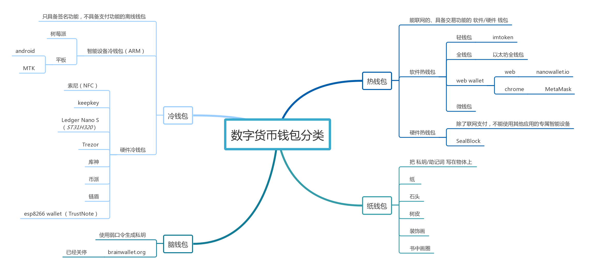
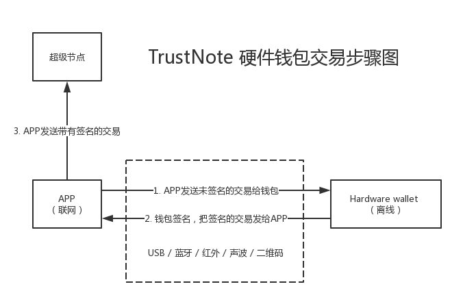

# esp8266 Wallet

### 介绍

esp8266 Wallet是一款基于esp8266芯片的硬件钱包。

### 结构

MCU：esp8266

显示器：ssd1306 oled （128*32像素）

3*3 按键 ：用于设置和输入PIN码

### 交易流程

1. 联网APP构造交易

   使用电脑端的app或手机端的app，联网状态下构造一个交易，并通过非网络方式，让硬件钱包对其进行签名（ecdsa）。

2. 离线硬件钱包签名

   通过USB、蓝牙、红外、二维码、声波等方式，对步骤1产生的交易进行签名，并将签名后的交易发给联网APP。

3. 联网APP发送交易

   得到硬件钱包签名后的交易，将其发送出去，从而完成了支付。

### 安全问题

1. 私钥保存在哪儿了？

   私钥保存在esp8266的芯片中。

2. 如何保障私钥的安全？

   1）私钥在硬件钱包中离线生成，从而实现隔离安全。

   2）私钥生成后，硬件钱包内置程序对写入的私钥进行哈希计算，每次启动时，会进行哈希对比，如果发现有篡改，则启动自毁程序，烧毁芯片。

   3）支付流程中，私钥不被联网APP读取，硬件钱包对联网APP构造的交易进行签名，但不会泄漏私钥。

3. esp8266可以用usb读写，如何避免黑客用串口破解？

   esp8266上面有TX、RX串口针脚，我们对其进行特殊处理，只要黑客不能链接到这2个针脚，就不能导出固件，也不能刷入黑客设置的陷阱固件。

4. esp8266具有wifi功能，如何做到离线不联网？

   esp8266内置wif，无法关闭。但该硬件钱包不用esp8266联网，也不通过wifi对外服务。因此无需担心wifi会有风险。

5. 未来会配置安全芯片吗？
   有这个可能，但必须使用开源芯片。

签名算法示例 https://www.programcreek.com/python/example/81785/ecdsa.SECP256k1
