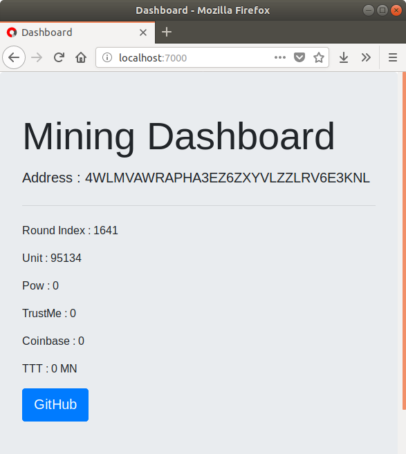

# Sample : Mining Helper SDK for Ruby

### install

```
sudo apt install ruby ruby-dev
sudo apt install libsqlite3-dev
sudo gem install sqlite3
sudo gem install ramaze
sudo gem install json
sudo gem install rufus-scheduler
```

### run trustnote-pow-supernode

```
git clone https://github.com/trustnote/trustnote-pow-supernode.git
cd trustnote-pow-supernode
npm install
node start.js
```

### run in Terminal

```
ruby cli.rb
```

### run in web

```
ruby web.rb
```

http://localhost:7000/

### Screenshot


